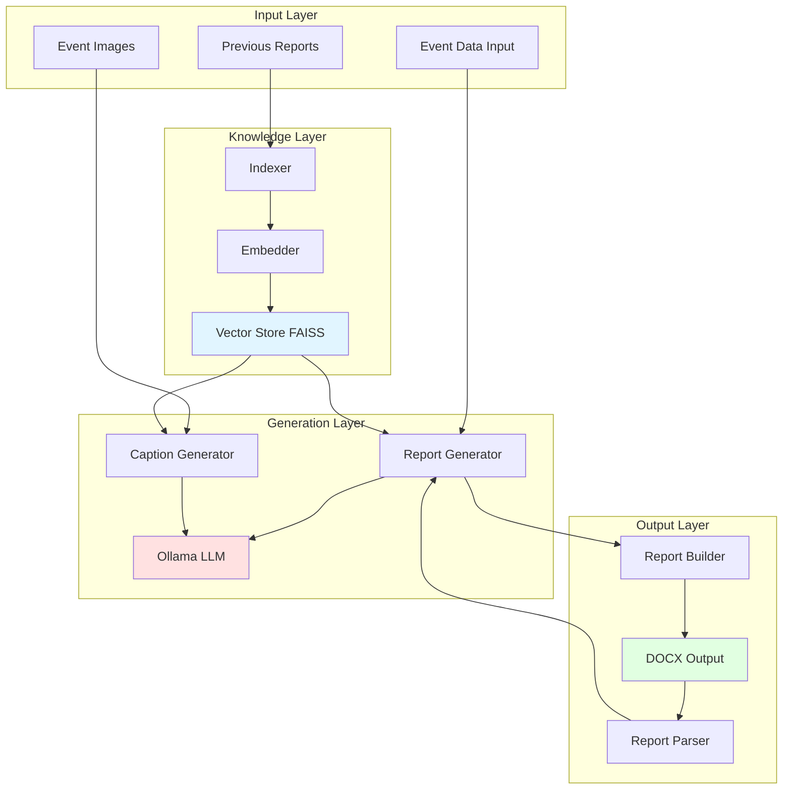
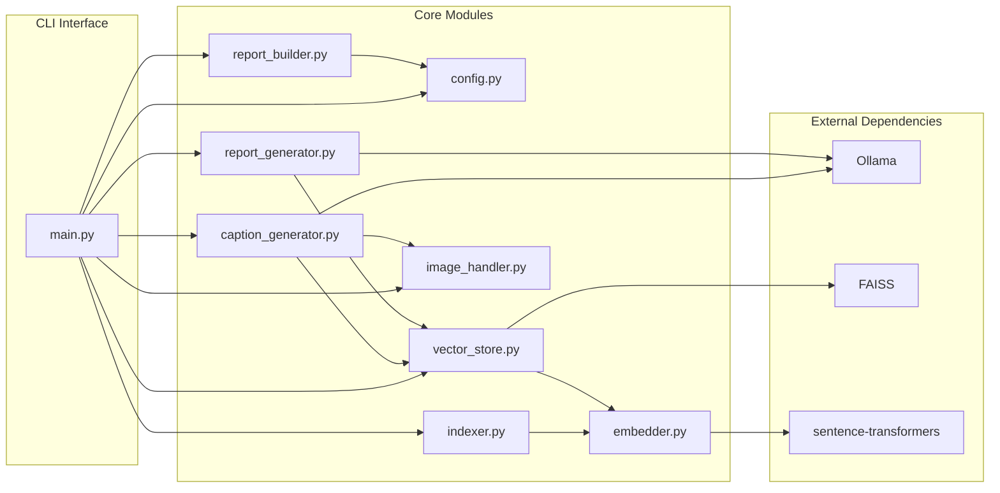
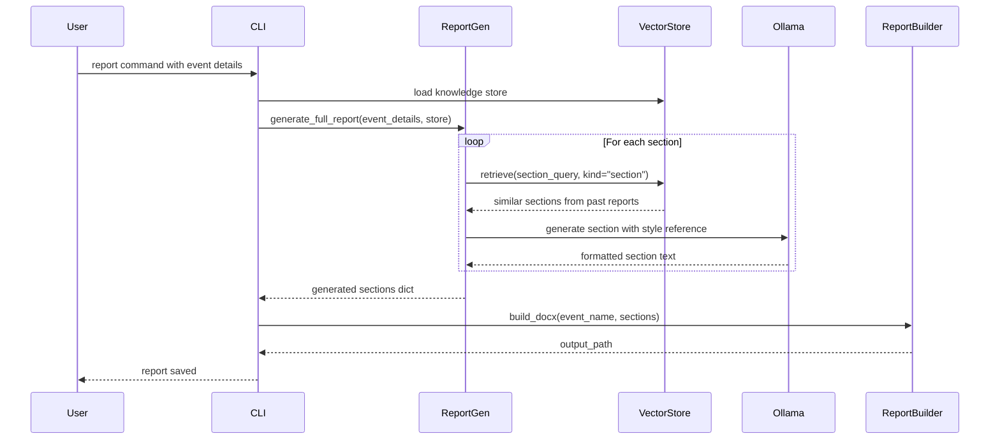
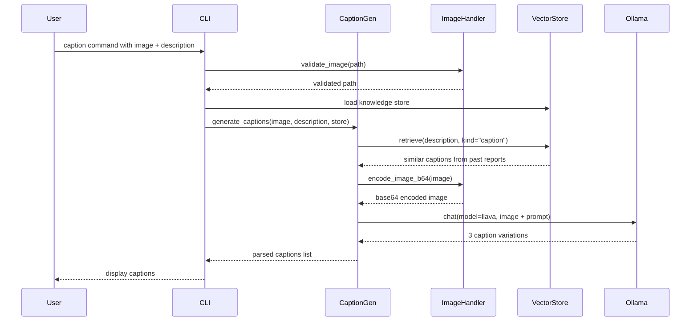

# Design Document: IEEE Event Report Generator

## Overview

The IEEE Event Report Generator is a Python-based system that transforms informal event abstracts into professionally formatted IEEE Student Branch event reports. The system leverages local LLM processing (Ollama with LLaVA and llama3), RAG (Retrieval-Augmented Generation) with FAISS vector storage, and structured document generation to produce formal documentation suitable for official IEEE submissions.

### System Context

The system operates entirely locally without external API dependencies, using:
- **Ollama** for LLM inference (llava for vision, llama3.2 for text)
- **sentence-transformers** for text embeddings (all-MiniLM-L6-v2)
- **FAISS** for vector similarity search
- **python-docx** for document generation

### Key Design Principles

1. **Local-First Architecture**: All processing occurs locally without external API calls
2. **RAG-Based Style Transfer**: Previous reports serve as style references via vector similarity search
3. **Fact Preservation**: User-provided facts are never invented or modified, only reformatted
4. **Structured Pipeline**: Clear separation between indexing, generation, and formatting stages
5. **Round-Trip Validation**: Generated reports can be parsed back into structured format for verification

## Architecture

### High-Level Architecture



### Component Architecture



### Data Flow

#### Report Generation Pipeline



#### Caption Generation Pipeline



## Components and Interfaces

### 1. Configuration Module (config.py)

**Purpose**: Centralized configuration management for all system settings.

**Interface**:
```python
# Path constants
BASE_DIR: Path
DATA_DIR: Path
REPORTS_DIR: Path
IMAGES_DIR: Path
VECTOR_STORE_DIR: Path
OUTPUTS_DIR: Path
VECTOR_STORE_PATH: Path

# Model configuration
VISION_MODEL: str = "llava"
TEXT_MODEL: str = "llama3.2"
EMBED_MODEL: str = "all-MiniLM-L6-v2"

# RAG settings
TOP_K_CAPTIONS: int = 5
TOP_K_SECTIONS: int = 3

# Image settings
SUPPORTED_IMAGE_FORMATS: set[str]
MAX_IMAGE_SIZE_MB: int = 20

# Report structure
REPORT_SECTIONS: list[str]
OPTIONAL_SECTIONS: set[str]

# Guidelines
CAPTION_GUIDELINES: str
REPORT_GUIDELINES: str
```

**Design Decisions**:
- Single source of truth for all configuration
- Guidelines embedded as constants for easy modification
- Path resolution relative to project root for portability

### 2. Indexer Module (indexer.py)

**Purpose**: Extract captions and sections from previous reports without LLM calls.

**Interface**:
```python
def read_document(file_path: str) -> str:
    """Read text from PDF or DOCX file."""
    
def extract_captions(file_path: str, model: str = TEXT_MODEL) -> list[dict]:
    """Extract image captions using regex patterns."""
    
def extract_sections(file_path: str, model: str = TEXT_MODEL) -> list[dict]:
    """Extract report sections using heading detection."""
    
def index_report(file_path: str, model: str = TEXT_MODEL) -> dict:
    """Full indexing pipeline returning captions and sections."""
```

**Data Structures**:
```python
# Caption entry
{
    "text": str,      # Caption text
    "kind": "caption",
    "source": str     # Source filename
}

# Section entry
{
    "text": str,      # Full section text
    "heading": str,   # Section heading
    "content": str,   # Section body without heading
    "kind": "section",
    "source": str     # Source filename
}
```

**Design Decisions**:
- Pure regex-based extraction for reliability and speed
- No LLM calls during indexing to avoid failures
- Fallback strategies when pattern matching fails
- Deduplication to avoid redundant entries

### 3. Embedder Module (embedder.py)

**Purpose**: Generate text embeddings using sentence-transformers.

**Interface**:
```python
def embed(texts: list[str]) -> np.ndarray:
    """Embed list of strings to L2-normalized vectors."""
    
def embed_one(text: str) -> np.ndarray:
    """Embed single string to vector."""
```

**Design Decisions**:
- Model cached with @lru_cache for efficiency
- L2 normalization for cosine similarity via dot product
- Batch processing support for multiple texts
- Returns numpy arrays for FAISS compatibility

### 4. Vector Store Module (vector_store.py)

**Purpose**: Unified FAISS-based vector storage for captions and sections.

**Interface**:
```python
class KnowledgeStore:
    def __init__(self, store_path: str | Path)
    
    def add(self, entries: list[dict]) -> int:
        """Embed and index entries."""
        
    def retrieve(self, query: str, top_k: int = 5, 
                 kind: str | None = None) -> list[dict]:
        """Find most similar entries, optionally filtered by kind."""
        
    def save(self) -> None:
        """Persist to disk."""
        
    def load(self) -> bool:
        """Load from disk."""
        
    def count(self, kind: str | None = None) -> int:
        """Count entries by kind."""
        
    def sources(self) -> list[str]:
        """List all source documents."""
```

**Internal State**:
```python
self.texts: list[str]           # Original text strings
self.metadata: list[dict]       # Entry metadata
self._index: faiss.Index        # FAISS IndexFlatIP
```

**Design Decisions**:
- Single store for both captions and sections with kind filtering
- FAISS IndexFlatIP for exact cosine similarity
- Pickle-based persistence for simplicity
- Over-fetching when filtering to ensure sufficient results

### 5. Image Handler Module (image_handler.py)

**Purpose**: Image validation, metadata extraction, and encoding.

**Interface**:
```python
def validate_image(image_path: str) -> Path:
    """Validate image exists and has supported format."""
    
def get_image_info(image_path: str) -> dict:
    """Extract image metadata."""
    
def encode_image_b64(image_path: str) -> str:
    """Encode image to base64 for Ollama."""
    
def discover_images(folder: str) -> list[Path]:
    """Find all supported images in folder."""
```

**Design Decisions**:
- Format validation before processing
- Size limits to prevent memory issues
- Base64 encoding for Ollama multimodal API
- Batch discovery for folder processing

### 6. Caption Generator Module (caption_generator.py)

**Purpose**: Generate IEEE-style captions using RAG and vision LLM.

**Interface**:
```python
def generate_captions(
    image_path: str,
    description: str,
    store: KnowledgeStore,
    model: str = VISION_MODEL
) -> list[str]:
    """Generate 3 IEEE-style caption variations."""
```

**Pipeline**:
1. Retrieve top-k similar captions from store using description as query
2. Build prompt with guidelines, style examples, and description
3. Encode image to base64
4. Call Ollama vision model (llava)
5. Parse response to extract 3 variations

**Design Decisions**:
- RAG provides style consistency from past reports
- Vision model sees both image and text description
- Multiple variations give user choice
- Robust parsing handles various output formats

### 7. Report Generator Module (report_generator.py)

**Purpose**: Generate report sections using RAG and text LLM.

**Interface**:
```python
def generate_section(
    section_name: str,
    user_facts: str,
    store: KnowledgeStore,
    model: str = TEXT_MODEL
) -> str:
    """Generate one report section with RAG style reference."""
    
def generate_full_report(
    event_details: dict[str, str],
    store: KnowledgeStore,
    model: str = TEXT_MODEL
) -> dict[str, str]:
    """Generate complete report section by section."""
```

**Pipeline**:
1. For each section, retrieve most similar section from past reports
2. Build prompt with guidelines, reference section, and user facts
3. Call Ollama text model (llama3.2)
4. Return generated section text
5. Skip optional sections if no user content provided

**Design Decisions**:
- Section-by-section generation for modularity
- RAG ensures style consistency with past reports
- Fallback prompt when no similar sections found
- Strict fact preservation through prompt engineering

### 8. Report Builder Module (report_builder.py)

**Purpose**: Build formatted DOCX documents matching IEEE Student Branch style.

**Interface**:
```python
def build_docx(
    event_name: str,
    sections: dict[str, str],
    output_path: str = None
) -> Path:
    """Build DOCX in Alumni Connect report style."""
```

**Document Structure**:
1. Cover page with title, date, venue
2. Introduction section
3. About the Speaker (optional, bullet list)
4. About the Session/Event (metadata + description)
5. Conclusion
6. SDG Impact (optional, bullet list)
7. IEEE Goals Achieved (optional, bullet list)
8. Acknowledgement (optional)

**Design Decisions**:
- Matches exact Alumni Connect report format
- Parses structured metadata from text (date, time, venue)
- Handles bullet point sections differently from prose
- Automatic filename generation with timestamp

### 9. CLI Interface (main.py)

**Purpose**: Command-line interface for all system operations.

**Commands**:
```python
# Index previous report
python main.py index --report <file>

# Generate caption for single image
python main.py caption --image <file> --text <description>

# Batch caption generation
python main.py caption-batch --folder <dir> [--text <description>]

# Generate full report
python main.py report --event <name> [--intro <text>] [--speaker <text>] 
                      [--about <text>] [--description <text>] 
                      [--conclusion <text>] [--sdg <text>] 
                      [--goals <text>] [--acknowledgement <text>]

# Show store status
python main.py status

# Clear store
python main.py clear
```

**Design Decisions**:
- Separate commands for distinct workflows
- Rich console output for better UX
- Validation before processing
- Helpful error messages with recovery suggestions

## Data Models

### Event_Data

**Purpose**: Structured representation of event information provided by user.

**Schema**:
```python
@dataclass
class EventData:
    """Event information for report generation."""
    
    # Required fields
    title: str                    # Event name
    
    # Core sections
    introduction: str = ""        # Purpose and context
    about_the_event: str = ""     # Date, time, venue, participants
    description: str = ""         # Chronological flow
    conclusion: str = ""          # Closing remarks
    
    # Optional sections
    about_the_speaker: str = ""   # Speaker details
    sdg_impact: str = ""          # SDG alignment
    ieee_goals: str = ""          # IEEE goals achieved
    acknowledgement: str = ""     # Thanks and credits
    
    # Metadata
    images: list[Path] = field(default_factory=list)
    
    def validate(self) -> list[str]:
        """Validate required fields and return error messages."""
        errors = []
        if not self.title.strip():
            errors.append("Event title is required")
        if not any([self.introduction, self.about_the_event, 
                   self.description, self.conclusion]):
            errors.append("At least one content section is required")
        return errors
    
    def to_dict(self) -> dict[str, str]:
        """Convert to dictionary for processing."""
        return {
            "title": self.title,
            "introduction": self.introduction,
            "about_the_speaker": self.about_the_speaker,
            "about_the_event": self.about_the_event,
            "description": self.description,
            "conclusion": self.conclusion,
            "sdg_impact": self.sdg_impact,
            "ieee_goals": self.ieee_goals,
            "acknowledgement": self.acknowledgement,
        }
```

### IEEE_Report

**Purpose**: Structured representation of generated report.

**Schema**:
```python
@dataclass
class IEEEReport:
    """Complete IEEE event report."""
    
    title: str
    sections: dict[str, ReportSection]
    metadata: ReportMetadata
    
    def to_text(self) -> str:
        """Serialize to formatted text representation."""
        lines = [f"# {self.title}", ""]
        for section_key in REPORT_SECTIONS:
            if section_key in self.sections:
                section = self.sections[section_key]
                lines.append(f"## {section.heading}")
                lines.append("")
                lines.append(section.content)
                lines.append("")
        return "\n".join(lines)
    
    @classmethod
    def from_text(cls, text: str) -> "IEEEReport":
        """Parse from formatted text representation."""
        # Implementation in report_parser module
        pass
    
    def to_docx(self, output_path: Path) -> Path:
        """Generate DOCX document."""
        sections_dict = {
            key: section.content 
            for key, section in self.sections.items()
        }
        return build_docx(self.title, sections_dict, str(output_path))

@dataclass
class ReportMetadata:
    """Report metadata."""
    generated_at: datetime
    source_event: str
    generator_version: str = "1.0"
```

### Report_Section

**Purpose**: Individual section within a report.

**Schema**:
```python
@dataclass
class ReportSection:
    """Single section of an IEEE report."""
    
    key: str                      # Section identifier (e.g., "introduction")
    heading: str                  # Display heading (e.g., "Introduction")
    content: str                  # Section body text
    section_type: SectionType     # Prose, bullet_list, or metadata
    
    def validate(self) -> list[str]:
        """Validate section content."""
        errors = []
        if not self.heading.strip():
            errors.append(f"Section {self.key} missing heading")
        if not self.content.strip():
            errors.append(f"Section {self.key} missing content")
        if self.section_type == SectionType.PROSE:
            if len(self.content.split()) < 20:
                errors.append(f"Section {self.key} content too short")
        return errors
    
    def word_count(self) -> int:
        """Count words in content."""
        return len(self.content.split())

class SectionType(Enum):
    """Section formatting type."""
    PROSE = "prose"              # Paragraph text
    BULLET_LIST = "bullet_list"  # Bullet points
    METADATA = "metadata"        # Key-value pairs
```

### Image_Caption

**Purpose**: Professional caption for event images.

**Schema**:
```python
@dataclass
class ImageCaption:
    """IEEE-style image caption."""
    
    image_path: Path
    caption_text: str
    variation_number: int         # 1, 2, or 3
    
    def validate(self) -> list[str]:
        """Validate caption meets IEEE guidelines."""
        errors = []
        word_count = len(self.caption_text.split())
        if word_count < 8:
            errors.append("Caption too short (minimum 8 words)")
        if word_count > 15:
            errors.append("Caption too long (maximum 15 words)")
        if any(emoji in self.caption_text for emoji in "😀🎉✨"):
            errors.append("Caption contains emojis")
        if any(word in self.caption_text.lower() 
               for word in ["we", "our", "i", "you"]):
            errors.append("Caption contains first/second person pronouns")
        return errors
```

## Correctness Properties

*A property is a characteristic or behavior that should hold true across all valid executions of a system—essentially, a formal statement about what the system should do. Properties serve as the bridge between human-readable specifications and machine-verifiable correctness guarantees.*

Before defining the correctness properties, I need to analyze each acceptance criterion for testability.


### Property 1: Event Data Acceptance

*For any* Event_Data object containing valid field values (event name, date, time, venue, speaker details, description, activities, participant count, outcomes, SDG alignment, IEEE goals), the Report_Generator should accept the input without raising validation errors.

**Validates: Requirements 1.1, 1.2, 1.3, 1.4, 1.5, 1.6, 1.7, 1.8, 1.9, 1.10**

### Property 2: Section Generation Completeness

*For any* Event_Data with non-empty content for a specific section (introduction, about_the_speaker, about_the_event, description, conclusion, sdg_impact, ieee_goals, acknowledgement), the generated IEEE_Report should contain that section with the corresponding heading.

**Validates: Requirements 2.1, 2.2, 2.3, 2.4, 2.5, 2.6, 2.7, 2.8**

### Property 3: Content Non-Repetition

*For any* generated Report_Section, no sentence should appear more than once within that section (exact duplicate detection).

**Validates: Requirements 3.5**

### Property 4: Section-Specific Formatting

*For any* generated IEEE_Report:
- Prose sections (introduction, about_the_event, description, conclusion, acknowledgement) should not contain bullet point markers (•, -, *)
- Bullet list sections (sdg_impact, ieee_goals) should contain bullet point markers

**Validates: Requirements 3.6, 3.7, 3.8**

### Property 5: Image Caption Generation

*For any* set of images provided with the Event_Data, the Report_Generator should generate exactly one caption per image, and all generated captions should appear in the final IEEE_Report.

**Validates: Requirements 4.1, 4.3**

### Property 6: DOCX Generation Success

*For any* valid IEEE_Report, the Report_Builder should successfully generate a DOCX file without errors, and the file should be readable by standard DOCX parsers.

**Validates: Requirements 5.1**

### Property 7: Section Order Preservation

*For any* IEEE_Report generated from Event_Data, the sections in the output should appear in the standard IEEE report order: Title → Introduction → About the Speaker → About the Event → Description → Conclusion → SDG Impact → IEEE Goals → Acknowledgement (with optional sections omitted if not provided).

**Validates: Requirements 5.2**

### Property 8: Validation Error Messages

*For any* Event_Data with invalid or missing required fields (empty title, invalid date format, invalid time format, unsupported image format), the Report_Generator should return a descriptive error message identifying the specific validation failure.

**Validates: Requirements 7.1, 7.2, 7.3, 7.4**

### Property 9: Report Round-Trip Preservation

*For any* valid IEEE_Report, parsing it into structured Report_Section objects, then formatting those objects back into text, then parsing again should produce equivalent structured content (idempotent serialization).

**Validates: Requirements 9.1, 9.3, 9.4**

### Property 10: Invalid Report Error Handling

*For any* malformed text that does not conform to IEEE_Report format, the Report_Parser should return a descriptive error message rather than crashing or producing invalid structured data.

**Validates: Requirements 9.2**

## Error Handling

### Error Categories

#### 1. Input Validation Errors

**File Not Found Errors**:
- Trigger: Referenced report or image file does not exist
- Handling: Raise `FileNotFoundError` with full path
- User Action: Verify file path and existence

**Format Validation Errors**:
- Trigger: Unsupported file format (not PDF/DOCX for reports, not JPG/PNG/WEBP/GIF for images)
- Handling: Raise `ValueError` with supported formats list
- User Action: Convert file to supported format

**Size Validation Errors**:
- Trigger: Image exceeds MAX_IMAGE_SIZE_MB
- Handling: Raise `ValueError` with size limit
- User Action: Compress or resize image

**Data Validation Errors**:
- Trigger: Missing required fields, invalid date/time formats
- Handling: Return structured validation error with field-specific messages
- User Action: Correct input data

#### 2. Processing Errors

**Ollama Connection Errors**:
- Trigger: Ollama service not running or unreachable
- Handling: Raise `ConnectionError` with instructions to run `ollama serve`
- User Action: Start Ollama service
- Recovery: Automatic retry after service starts

**Model Not Found Errors**:
- Trigger: Required model (llava, llama3.2) not pulled
- Handling: Raise `ValueError` with pull command
- User Action: Run `ollama pull <model>`

**Empty Knowledge Store Errors**:
- Trigger: Attempting generation with empty vector store
- Handling: Display warning with indexing instructions
- User Action: Run `python main.py index --report <file>`

**Parsing Errors**:
- Trigger: LLM output doesn't match expected format
- Handling: Fallback parsing with relaxed patterns
- User Action: None (automatic recovery)

#### 3. Generation Errors

**Insufficient Context Errors**:
- Trigger: No similar sections found in knowledge store
- Handling: Use fallback prompt without style reference
- User Action: Index more reference reports for better results

**Content Quality Warnings**:
- Trigger: Generated section too short or contains prohibited patterns
- Handling: Log warning, continue processing
- User Action: Review and manually edit if needed

### Error Handling Strategy

```python
class ReportGenerationError(Exception):
    """Base exception for report generation errors."""
    pass

class ValidationError(ReportGenerationError):
    """Input validation failed."""
    def __init__(self, field: str, message: str):
        self.field = field
        self.message = message
        super().__init__(f"Validation error in {field}: {message}")

class ProcessingError(ReportGenerationError):
    """Error during report processing."""
    pass

class OllamaError(ProcessingError):
    """Ollama service error."""
    pass

# Error handling pattern
def generate_report_safe(event_data: EventData) -> tuple[IEEEReport | None, list[str]]:
    """
    Generate report with comprehensive error handling.
    Returns: (report, errors) where report is None if generation failed.
    """
    errors = []
    
    try:
        # Validate input
        validation_errors = event_data.validate()
        if validation_errors:
            return None, validation_errors
        
        # Check prerequisites
        if not ollama_is_running():
            errors.append("Ollama service not running. Run: ollama serve")
            return None, errors
        
        # Generate report
        report = generate_full_report(event_data.to_dict(), store)
        return report, []
        
    except ValidationError as e:
        errors.append(f"Validation failed: {e.message}")
    except OllamaError as e:
        errors.append(f"LLM error: {e}. Check Ollama service.")
    except Exception as e:
        errors.append(f"Unexpected error: {e}")
        logger.exception("Report generation failed")
    
    return None, errors
```

### Logging Strategy

```python
import logging

# Configure logging
logging.basicConfig(
    level=logging.INFO,
    format='%(asctime)s - %(name)s - %(levelname)s - %(message)s',
    handlers=[
        logging.FileHandler('ieee_report_gen.log'),
        logging.StreamHandler()
    ]
)

logger = logging.getLogger(__name__)

# Log key events
logger.info(f"Indexing report: {report_path}")
logger.info(f"Generated section: {section_name} ({word_count} words)")
logger.warning(f"No similar sections found for: {section_name}")
logger.error(f"Ollama connection failed: {error}")
```

## Testing Strategy

### Dual Testing Approach

The IEEE Event Report Generator requires both unit testing and property-based testing for comprehensive coverage:

- **Unit tests**: Verify specific examples, edge cases, and error conditions
- **Property tests**: Verify universal properties across all inputs

Together, these approaches provide comprehensive coverage where unit tests catch concrete bugs and property tests verify general correctness.

### Unit Testing

Unit tests focus on:

1. **Specific Examples**:
   - Known good report generates expected sections
   - Specific date formats parse correctly
   - Example image produces valid caption

2. **Edge Cases**:
   - Empty optional sections are omitted
   - Images with no captions provided
   - Reports with only required sections
   - Maximum length inputs
   - Special characters in text

3. **Integration Points**:
   - Ollama API communication
   - FAISS vector store operations
   - DOCX file generation
   - File I/O operations

4. **Error Conditions**:
   - Missing required fields
   - Invalid file formats
   - Ollama service down
   - Empty knowledge store

**Example Unit Tests**:

```python
def test_event_data_validation_missing_title():
    """Test that missing title raises validation error."""
    event_data = EventData(title="", introduction="Some intro")
    errors = event_data.validate()
    assert "title is required" in errors[0].lower()

def test_report_section_order():
    """Test that sections appear in correct order."""
    sections = {
        "conclusion": "Conclusion text",
        "introduction": "Intro text",
        "about_the_event": "Event text"
    }
    report = IEEEReport(title="Test", sections=sections, metadata=...)
    text = report.to_text()
    intro_pos = text.find("Introduction")
    event_pos = text.find("About the Event")
    conclusion_pos = text.find("Conclusion")
    assert intro_pos < event_pos < conclusion_pos

def test_image_validation_unsupported_format():
    """Test that unsupported image format raises error."""
    with pytest.raises(ValueError, match="Unsupported format"):
        validate_image("test.bmp")
```

### Property-Based Testing

Property-based testing uses **fast-check** (JavaScript) or **Hypothesis** (Python) to verify universal properties across randomly generated inputs.

**Configuration**:
- Minimum 100 iterations per property test
- Each test tagged with reference to design property
- Tag format: `# Feature: ieee-event-report-generator, Property {number}: {property_text}`

**Property Test Library**: Hypothesis (Python)

**Example Property Tests**:

```python
from hypothesis import given, strategies as st
import hypothesis

# Feature: ieee-event-report-generator, Property 1: Event Data Acceptance
@given(
    title=st.text(min_size=1, max_size=200),
    date=st.dates(),
    time=st.times(),
    venue=st.text(min_size=1, max_size=500),
    description=st.text(min_size=10, max_size=5000)
)
@hypothesis.settings(max_examples=100)
def test_property_event_data_acceptance(title, date, time, venue, description):
    """Property 1: For any valid Event_Data, system accepts without error."""
    event_data = EventData(
        title=title,
        introduction=description,
        about_the_event=f"Date: {date}, Time: {time}, Venue: {venue}"
    )
    errors = event_data.validate()
    assert len(errors) == 0, f"Valid data rejected: {errors}"

# Feature: ieee-event-report-generator, Property 2: Section Generation Completeness
@given(
    title=st.text(min_size=1, max_size=200),
    sections=st.dictionaries(
        keys=st.sampled_from(["introduction", "conclusion", "description"]),
        values=st.text(min_size=20, max_size=1000),
        min_size=1
    )
)
@hypothesis.settings(max_examples=100)
def test_property_section_generation_completeness(title, sections):
    """Property 2: For any Event_Data with section content, that section appears in report."""
    event_data = EventData(title=title, **sections)
    report = generate_full_report(event_data.to_dict(), store)
    
    for section_key, content in sections.items():
        assert section_key in report, f"Section {section_key} missing from report"
        assert len(report[section_key]) > 0, f"Section {section_key} is empty"

# Feature: ieee-event-report-generator, Property 3: Content Non-Repetition
@given(
    section_text=st.text(min_size=100, max_size=2000)
)
@hypothesis.settings(max_examples=100)
def test_property_content_non_repetition(section_text):
    """Property 3: For any generated section, no sentence appears more than once."""
    # Generate section (mocked for property test)
    section = ReportSection(
        key="introduction",
        heading="Introduction",
        content=section_text,
        section_type=SectionType.PROSE
    )
    
    sentences = [s.strip() for s in section.content.split('.') if s.strip()]
    unique_sentences = set(sentences)
    
    assert len(sentences) == len(unique_sentences), \
        f"Found duplicate sentences in section"

# Feature: ieee-event-report-generator, Property 9: Report Round-Trip Preservation
@given(
    title=st.text(min_size=1, max_size=200),
    sections=st.dictionaries(
        keys=st.sampled_from(["introduction", "conclusion"]),
        values=st.text(min_size=20, max_size=500),
        min_size=1
    )
)
@hypothesis.settings(max_examples=100)
def test_property_report_round_trip_preservation(title, sections):
    """Property 9: For any valid report, parse→format→parse produces equivalent content."""
    # Create report
    report1 = IEEEReport(
        title=title,
        sections={k: ReportSection(k, k.title(), v, SectionType.PROSE) 
                  for k, v in sections.items()},
        metadata=ReportMetadata(...)
    )
    
    # Round trip: report → text → report → text
    text1 = report1.to_text()
    report2 = IEEEReport.from_text(text1)
    text2 = report2.to_text()
    
    # Texts should be equivalent (allowing for whitespace normalization)
    assert normalize_whitespace(text1) == normalize_whitespace(text2), \
        "Round-trip parsing changed content"
```

### Test Organization

```
tests/
├── unit/
│   ├── test_config.py
│   ├── test_indexer.py
│   ├── test_embedder.py
│   ├── test_vector_store.py
│   ├── test_image_handler.py
│   ├── test_caption_generator.py
│   ├── test_report_generator.py
│   ├── test_report_builder.py
│   └── test_cli.py
├── property/
│   ├── test_properties_input.py
│   ├── test_properties_generation.py
│   ├── test_properties_formatting.py
│   └── test_properties_roundtrip.py
├── integration/
│   ├── test_full_pipeline.py
│   └── test_cli_commands.py
└── fixtures/
    ├── sample_reports/
    ├── sample_images/
    └── sample_event_data.py
```

### Test Coverage Goals

- Unit test coverage: >80% of code lines
- Property test coverage: All 10 correctness properties
- Integration test coverage: All CLI commands and workflows
- Edge case coverage: All error conditions and boundary cases

### Continuous Testing

```yaml
# .github/workflows/test.yml
name: Test Suite
on: [push, pull_request]
jobs:
  test:
    runs-on: ubuntu-latest
    steps:
      - uses: actions/checkout@v2
      - name: Set up Python
        uses: actions/setup-python@v2
        with:
          python-version: '3.11'
      - name: Install dependencies
        run: |
          pip install -r requirements.txt
          pip install pytest hypothesis pytest-cov
      - name: Run unit tests
        run: pytest tests/unit/ -v --cov=src
      - name: Run property tests
        run: pytest tests/property/ -v
      - name: Run integration tests
        run: pytest tests/integration/ -v
```

## Implementation Notes

### CLI Argument Parsing Refinement

The current CLI implementation has some issues with the `report` command argument parsing. Here's the recommended refinement:

**Current Issues**:
1. Arguments use inconsistent naming (--intro vs --introduction)
2. Some section names don't match internal keys
3. No validation of mutually exclusive options
4. Help text could be clearer

**Recommended Changes**:

```python
# Improved report command definition
p = sub.add_parser("report", 
    help="Generate a full event report DOCX",
    description="Generate an IEEE Student Branch event report from text descriptions.")

# Required argument
p.add_argument("--event", required=True, metavar="TITLE",
               help="Event title (e.g., 'IEEE Student Branch Induction 2024')")

# Core sections (at least one required)
core_group = p.add_argument_group("core sections", 
                                  "At least one core section is required")
core_group.add_argument("--introduction", metavar="TEXT",
                       help="Introduction: purpose and context of the event")
core_group.add_argument("--about-event", metavar="TEXT",
                       help="About the Event: date, time, venue, participants")
core_group.add_argument("--description", metavar="TEXT",
                       help="Description: chronological flow of activities")
core_group.add_argument("--conclusion", metavar="TEXT",
                       help="Conclusion: closing remarks and impact")

# Optional sections
opt_group = p.add_argument_group("optional sections")
opt_group.add_argument("--speaker", metavar="TEXT",
                      help="About the Speaker: name, designation, background")
opt_group.add_argument("--sdg", metavar="TEXT",
                      help="SDG Impact: sustainable development goals alignment")
opt_group.add_argument("--ieee-goals", metavar="TEXT",
                      help="IEEE Goals: IEEE goals and vision achieved")
opt_group.add_argument("--acknowledgement", metavar="TEXT",
                      help="Acknowledgement: thanks to faculty, sponsors, organizers")

# Output options
p.add_argument("--output", "-o", metavar="PATH",
              help="Output file path (default: auto-generated in outputs/)")

# Validation in cmd_report
def cmd_report(args) -> None:
    # Map CLI args to internal keys
    event_details = {
        "title": args.event,
        "introduction": getattr(args, "introduction", "") or "",
        "about_the_speaker": getattr(args, "speaker", "") or "",
        "about_the_event": getattr(args, "about_event", "") or "",
        "description": getattr(args, "description", "") or "",
        "conclusion": getattr(args, "conclusion", "") or "",
        "sdg_impact": getattr(args, "sdg", "") or "",
        "ieee_goals": getattr(args, "ieee_goals", "") or "",
        "acknowledgement": getattr(args, "acknowledgement", "") or "",
    }
    
    # Validate at least one core section provided
    core_sections = ["introduction", "about_the_event", "description", "conclusion"]
    if not any(event_details.get(s) for s in core_sections):
        console.print("[red]Error:[/] At least one core section required")
        console.print("Core sections: --introduction, --about-event, --description, --conclusion")
        sys.exit(1)
    
    # Continue with generation...
```

### Performance Considerations

1. **Embedding Cache**: The embedder uses @lru_cache to avoid reloading the model
2. **Batch Processing**: Vector store supports batch embedding for efficiency
3. **Lazy Loading**: Knowledge store only loaded when needed
4. **Streaming Output**: Rich console uses streaming for better UX

### Security Considerations

1. **Path Traversal**: All file paths validated and resolved
2. **File Size Limits**: Images limited to MAX_IMAGE_SIZE_MB
3. **Input Sanitization**: User text sanitized before LLM prompts
4. **Local Processing**: No data sent to external services

### Extensibility Points

1. **Custom Templates**: Report builder can be extended with new templates
2. **Additional Models**: Config allows swapping Ollama models
3. **New Sections**: REPORT_SECTIONS list easily extended
4. **Custom Guidelines**: CAPTION_GUIDELINES and REPORT_GUIDELINES configurable

## Appendix: Report Parser and Formatter Specification

To support round-trip testing (Property 9), we need to implement a report parser and formatter.

### Report Parser

**Purpose**: Parse IEEE_Report text into structured Report_Section objects.

**Interface**:
```python
def parse_ieee_report(text: str) -> IEEEReport:
    """
    Parse IEEE report text into structured format.
    
    Expected format:
    # Title
    
    ## Section Heading
    
    Section content...
    
    ## Next Section
    ...
    """
    
class ReportParser:
    def parse(self, text: str) -> IEEEReport:
        """Parse report text."""
        
    def _extract_title(self, text: str) -> str:
        """Extract title from first heading."""
        
    def _extract_sections(self, text: str) -> dict[str, ReportSection]:
        """Extract all sections."""
        
    def _detect_section_type(self, content: str) -> SectionType:
        """Detect if section is prose, bullet list, or metadata."""
```

**Implementation Strategy**:
```python
import re
from typing import Dict, List

class ReportParser:
    # Section heading pattern: ## Heading
    HEADING_PATTERN = re.compile(r'^##\s+(.+)$', re.MULTILINE)
    # Title pattern: # Title
    TITLE_PATTERN = re.compile(r'^#\s+(.+)$', re.MULTILINE)
    # Bullet pattern
    BULLET_PATTERN = re.compile(r'^\s*[•\-\*]\s+', re.MULTILINE)
    # Metadata pattern: Key: Value
    METADATA_PATTERN = re.compile(r'^([A-Z][a-z\s]+):\s*(.+)$', re.MULTILINE)
    
    def parse(self, text: str) -> IEEEReport:
        # Extract title
        title_match = self.TITLE_PATTERN.search(text)
        if not title_match:
            raise ValueError("No title found in report")
        title = title_match.group(1).strip()
        
        # Extract sections
        sections = self._extract_sections(text)
        
        # Create metadata
        metadata = ReportMetadata(
            generated_at=datetime.now(),
            source_event=title
        )
        
        return IEEEReport(title=title, sections=sections, metadata=metadata)
    
    def _extract_sections(self, text: str) -> Dict[str, ReportSection]:
        sections = {}
        
        # Find all section headings
        headings = list(self.HEADING_PATTERN.finditer(text))
        
        for i, match in enumerate(headings):
            heading = match.group(1).strip()
            start = match.end()
            end = headings[i+1].start() if i+1 < len(headings) else len(text)
            content = text[start:end].strip()
            
            # Map heading to section key
            section_key = self._heading_to_key(heading)
            
            # Detect section type
            section_type = self._detect_section_type(content)
            
            sections[section_key] = ReportSection(
                key=section_key,
                heading=heading,
                content=content,
                section_type=section_type
            )
        
        return sections
    
    def _heading_to_key(self, heading: str) -> str:
        """Map display heading to internal key."""
        mapping = {
            "Introduction": "introduction",
            "About the Speaker": "about_the_speaker",
            "About the Session": "about_the_event",
            "About the Event": "about_the_event",
            "Description": "description",
            "Conclusion": "conclusion",
            "SDG Impact": "sdg_impact",
            "IEEE Goals and Vision Achieved": "ieee_goals",
            "IEEE Goals": "ieee_goals",
            "Acknowledgement": "acknowledgement",
        }
        return mapping.get(heading, heading.lower().replace(" ", "_"))
    
    def _detect_section_type(self, content: str) -> SectionType:
        """Detect section formatting type."""
        # Check for bullet points
        if self.BULLET_PATTERN.search(content):
            return SectionType.BULLET_LIST
        
        # Check for metadata lines
        lines = content.split('\n')
        metadata_lines = sum(1 for line in lines 
                           if self.METADATA_PATTERN.match(line))
        if metadata_lines > len(lines) / 2:
            return SectionType.METADATA
        
        return SectionType.PROSE
```

### Report Formatter

**Purpose**: Format structured Report_Section objects into IEEE_Report text.

**Interface**:
```python
def format_ieee_report(report: IEEEReport) -> str:
    """Format structured report into text."""
    
class ReportFormatter:
    def format(self, report: IEEEReport) -> str:
        """Format report to text."""
        
    def _format_section(self, section: ReportSection) -> str:
        """Format individual section."""
```

**Implementation Strategy**:
```python
class ReportFormatter:
    def format(self, report: IEEEReport) -> str:
        lines = [f"# {report.title}", ""]
        
        # Format sections in standard order
        for section_key in REPORT_SECTIONS:
            if section_key in report.sections:
                section = report.sections[section_key]
                lines.append(self._format_section(section))
                lines.append("")
        
        return "\n".join(lines)
    
    def _format_section(self, section: ReportSection) -> str:
        lines = [f"## {section.heading}", ""]
        
        if section.section_type == SectionType.PROSE:
            # Format as paragraphs
            lines.append(section.content)
        elif section.section_type == SectionType.BULLET_LIST:
            # Ensure bullet formatting
            for line in section.content.split('\n'):
                line = line.strip()
                if line and not line.startswith(('•', '-', '*')):
                    lines.append(f"• {line}")
                else:
                    lines.append(line)
        elif section.section_type == SectionType.METADATA:
            # Format as key-value pairs
            lines.append(section.content)
        
        return "\n".join(lines)
```

### Round-Trip Testing

```python
def test_round_trip_preservation():
    """Test that parse→format→parse preserves content."""
    # Original report
    original_text = """# IEEE Student Branch Induction 2024

## Introduction

The induction ceremony was held on 10th March 2024.

## Conclusion

The event successfully achieved its objectives.
"""
    
    # Parse
    parser = ReportParser()
    report1 = parser.parse(original_text)
    
    # Format
    formatter = ReportFormatter()
    formatted_text = formatter.format(report1)
    
    # Parse again
    report2 = parser.parse(formatted_text)
    
    # Compare
    assert report1.title == report2.title
    assert len(report1.sections) == len(report2.sections)
    for key in report1.sections:
        assert key in report2.sections
        assert normalize_whitespace(report1.sections[key].content) == \
               normalize_whitespace(report2.sections[key].content)
```

---

## Summary

This design document specifies a comprehensive architecture for the IEEE Event Report Generator that:

1. Leverages existing implementation modules with clear interfaces
2. Defines structured data models for Event_Data, IEEE_Report, and Report_Section
3. Specifies a RAG-based generation pipeline using local LLMs
4. Includes parsing and formatting logic for round-trip validation
5. Addresses CLI refinements for better usability
6. Defines 10 correctness properties for property-based testing
7. Specifies comprehensive error handling and validation strategies
8. Provides a dual testing approach with both unit and property tests

The design maintains the local-first architecture, preserves factual accuracy, and enables verification through round-trip testing while producing professional IEEE Student Branch documentation.
